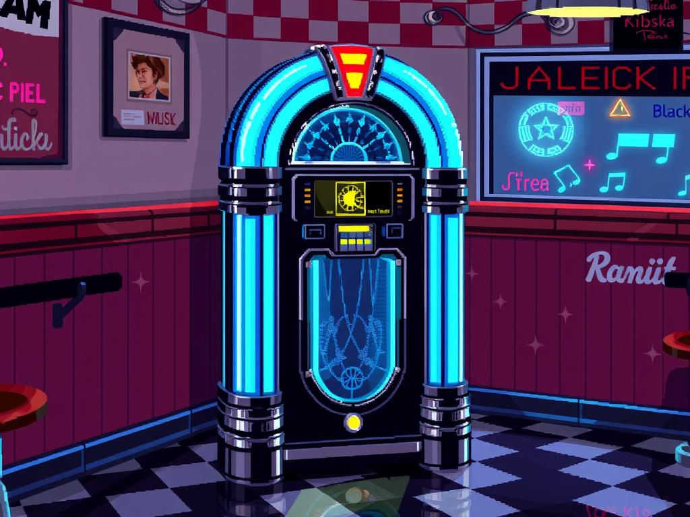

**Model**: [gpt-4o (openai/gpt-4o)](https://github.com/marketplace/models/azure-openai/gpt-4o)

**Prompt**: 16-bit pixel art of a glowing crystal jukebox made of glass and chrome, pulsing neon lights, sitting in a cozy retro diner corner with checkerboard floor.

## Generated Image

