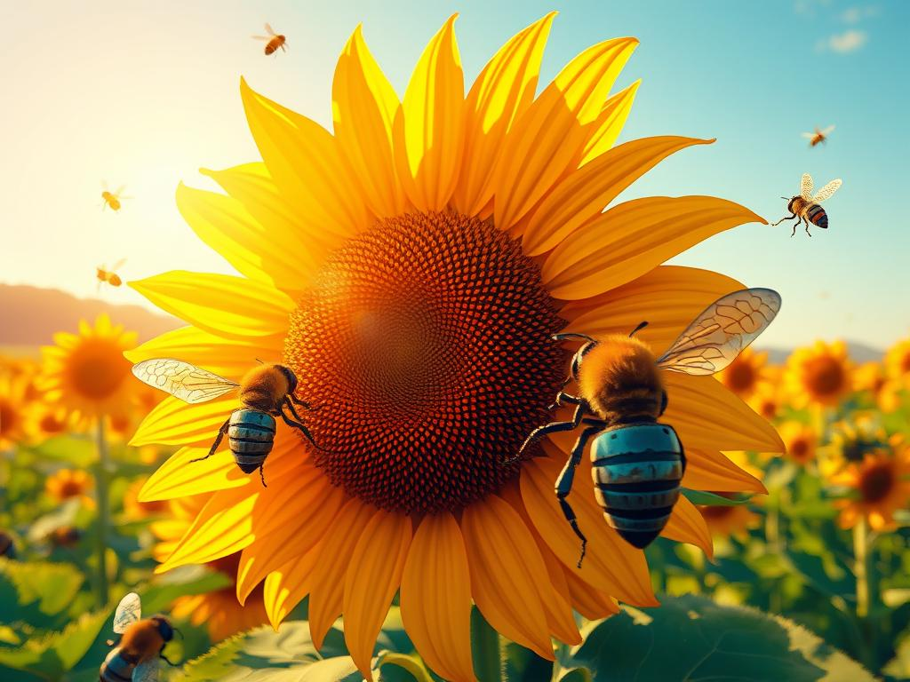

**Model**: [phi-3-medium-128k-instruct (microsoft/phi-3-medium-128k-instruct)](https://github.com/marketplace/models/azureml/Phi-3-medium-128k-instruct)

**Prompt**:  "Pixel art representation of a glowing, radiant sunflower field with metallic, rust-resistant robot bees buzzing around."

## Generated Image

