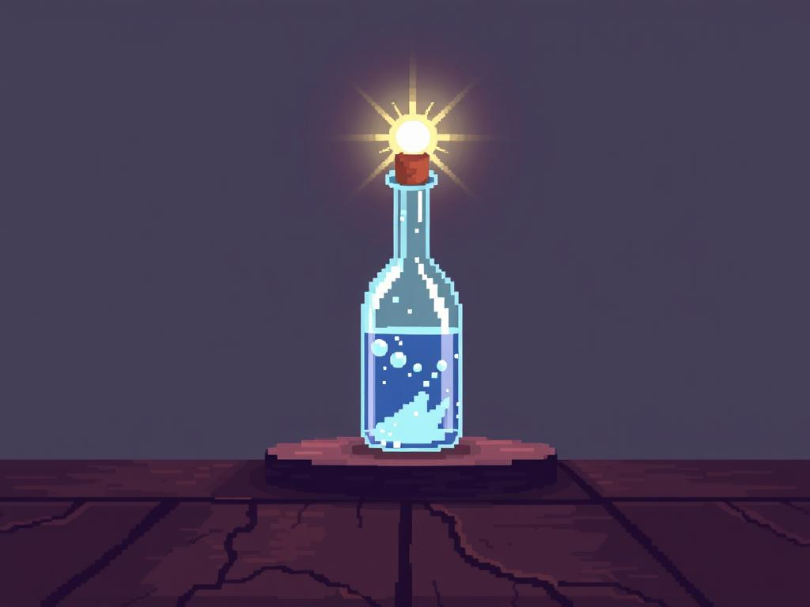

**Model**: [gpt-4.1-mini (openai/gpt-4.1-mini)](https://github.com/marketplace/models/azure-openai/gpt-4-1-mini)

**Prompt**: 16-bit pixel art of a glowing glass potion bottle on a wooden table, radiant sunlight casting bright reflections and sparkling highlights, simple gradient background.

## Generated Image

