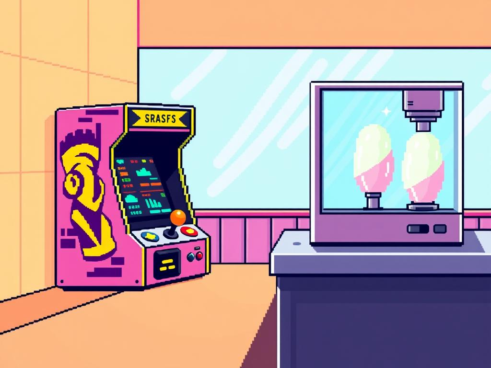

**Model**: [phi-4-mini-instruct (microsoft/phi-4-mini-instruct)](https://github.com/marketplace/models/azureml/Phi-4-mini-instruct)

**Prompt**: "16-bit pixel art: Splendid arcade machine at a bright, sunny arcade counter; stats box glitches cheerfully, joystick glowing warmly; pixelated candy floss stand with pastel-colored dispenser, metal countertop."

## Generated Image

