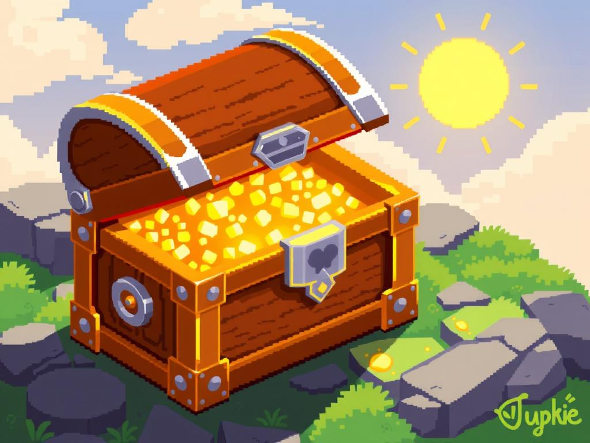

**Model**: [grok-3 (xai/grok-3)](https://github.com/marketplace/models/azureml-xai/grok-3)

**Prompt**: 16-bit pixel art of a radiant, glowing treasure chest made of polished wood and shiny metal, in isometric view with a sunny background.

## Generated Image

