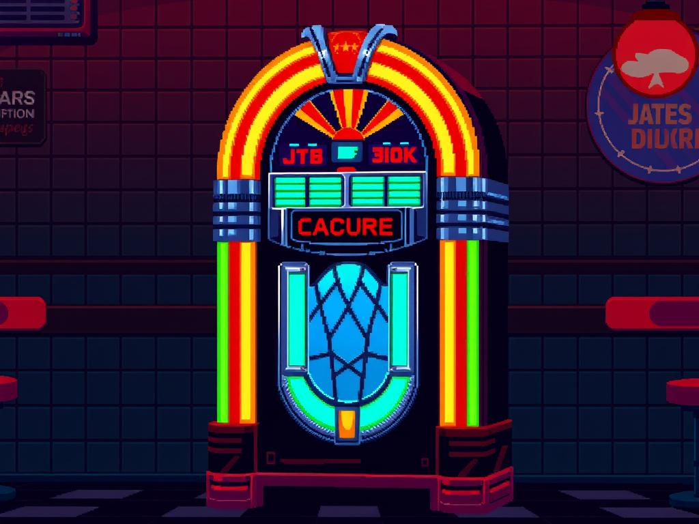

**Model**: [gpt-4o (openai/gpt-4o)](https://github.com/marketplace/models/azure-openai/gpt-4o)

**Prompt**: 16-bit pixel art of a glowing neon jukebox with chrome accents, vibrant glass panels, and a wooden base, illuminated against a dark retro diner background.

## Generated Image

