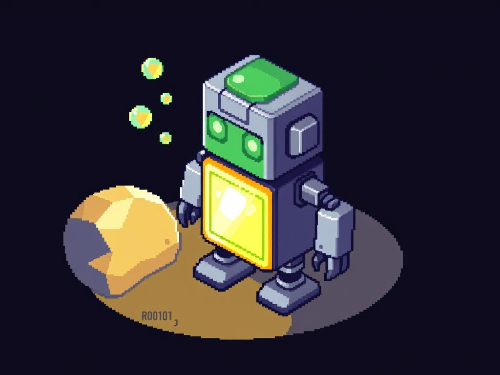

**Model**: [mai-ds-r1 (microsoft/mai-ds-r1)](https://github.com/marketplace/models/azureml/MAI-DS-R1)

**Prompt**: <think>
Okay, let me try to figure out how to approach this. The user wants a pixel art prompt following specific rules. Let me go through each rule step by step.

First, it must be pixel art with an 8-bit or 16-bit retro game style. So, chunky pixels, strong outlines, limited color palette (16-32 colors), maybe some dithering. Got it. 

Next, the subject needs to be inanimate. They listed objects, vehicles, buildings, instruments, food, or cute robots. No people or animals. So I have to pick something from those categories. Let me brainstorm ideas. Maybe a robot? A cute robot could work. Or maybe a vehicle, like a spaceship. Or an object, like a glowing crystal. 

Composition: single subject or small scene. Isometric or side view. Background should be clean or simple. Maybe a single object with a simple background. 

Bright lighting cues: sunny, glowing, radiant, luminous, or studio lighting. Material hints like metal, glass, wood. So the object should have materials that reflect light well, like metals or glass. Maybe a robot with metallic parts and glowing elements. 

Concise, about one short sentence, 25 words max. Start with "pixel art", "8-bit", or "16-bit". 

So putting this together. Let's try a cute robot. Maybe a delivery robot. It's holding something, like a pizza box. The robot can have a rounded, friendly design. Materials: metal body, maybe some glass parts like a visor. Glowing elements, like neon lights or LEDs. Background could be a simple street at dusk with some gradient. 

Wait, the background needs to be clean. Maybe a gradient sky with stars? Or a simple cityscape in the background. Let me check the word count. "8-bit pixel art of a cheerful delivery robot balancing a glowing pizza box on its head, metallic turquoise body with neon orange accents, dusk cityscape backdrop with gradient sky." That's 25 words. 

Does this fit all the rules? Let's check:

1. Pixel art style: yes, 8-bit mentioned.
2. Subject: robot (cute), inanimate. Good.
3. Single subject with small scene (cityscape backdrop). Isometric or side view? The prompt says "balancing on its head", maybe side view. Background is simple gradient. 
4. Bright lighting: glowing pizza box, neon accents, dusk with gradient sky (implies sunset colors). Materials: metallic body, maybe the pizza box has some material like cardboard or glowing elements. 
5. Concise: 25 words. 

I think that works. Maybe adjust the colors for more vibrancy. Turquoise and neon orange are bright. The dusk cityscape adds a nice contrast. Yeah, this should be a valid prompt.
</think>

16-bit pixel art of a luminous glass terrarium with floating origami stars, glowing cyan core, metallic copper frame, and soft dithering on a gradient indigo backdrop.

## Generated Image

