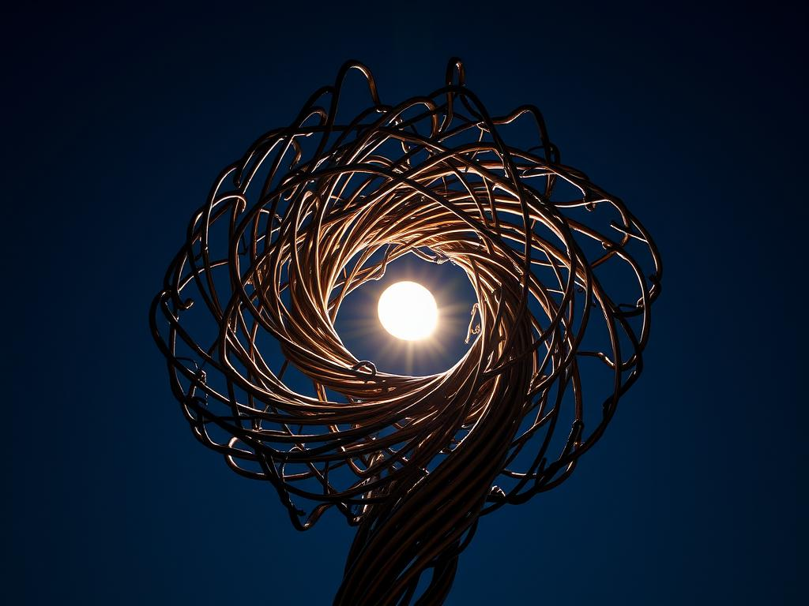

**Model**: [phi-3.5-vision-instruct (microsoft/phi-3.5-vision-instruct)](https://github.com/marketplace/models/azureml/Phi-3-5-vision-instruct)

**Prompt**:  A twisted metal sculpture transforms into a swirling vortex of energy when moonlight strikes it at just the right angle.

## Generated Image

