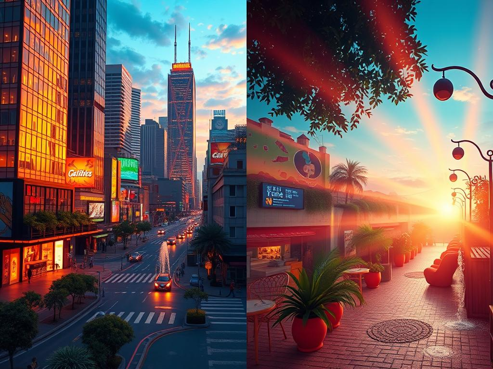

**Model**: [phi-3.5-mini-instruct (microsoft/phi-3.5-mini-instruct)](https://github.com/marketplace/models/azureml/Phi-3-5-mini-instruct)

**Prompt**:  A bustling cityscape at sunrise, with skyscrapers ablaze in warm orange and pink hues, reflecting vibrant rainbows off their glass facades. The streets are alive with luminous neon signs and vibrant murals, while self-driving cars glide on solar-powered roads. A whimsical mural of lush, greenery-adorned furniture in a sunlit studio apartment complete with bold, textured patterns and multicolored accents. The air shimmers with the light of bioluminescent street lamps, casting a radiant glow over a labyrinth of cobblestone pathways and glistening fountains.

## Generated Image

