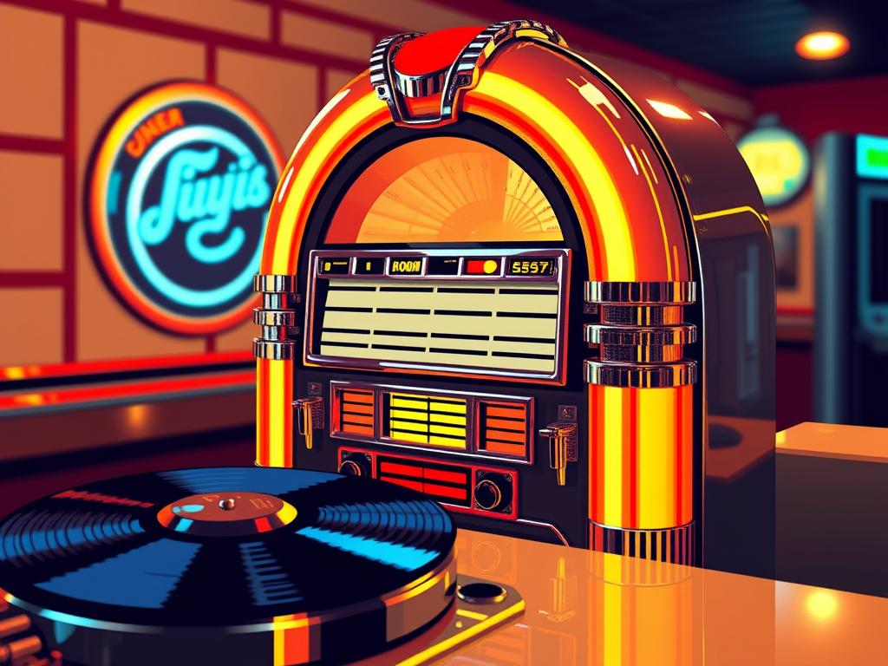

**Model**: [llama-3.2-11b-vision-instruct (meta/llama-3.2-11b-vision-instruct)](https://github.com/marketplace/models/azureml-meta/Llama-3-2-11B-Vision-Instruct)

**Prompt**: 16-bit pixel art: A gleaming, chrome-plated, 1950s-style diner jukebox, bathed in warm, golden studio lighting, with spinning vinyl records.

## Generated Image

